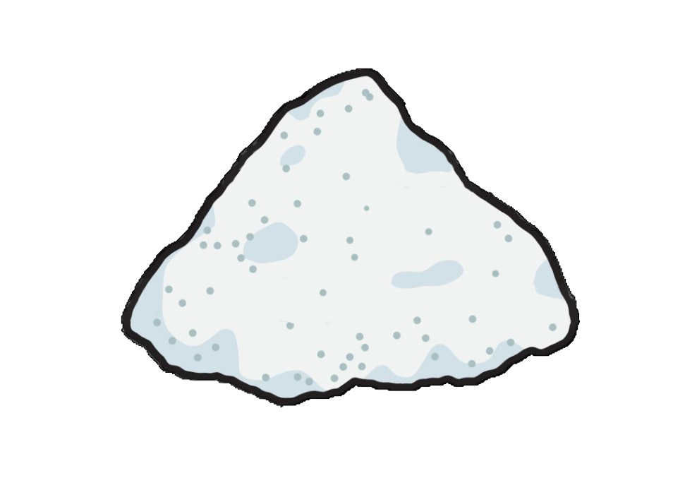

# Salty Clicker

Salty clicker es un juego de tipo incremental en desarrollo por el equipo de jugadores <strong>FKBZ</strong>

# Nuestro equipo

<ul>
  <li>Maximiliano: Desarrollador general</li>
  <li>Ignacio: Diseñador general</li>
  <li>Nahuel: Director general de pruebas </li>
  <li>Marcos</li>
  <li>Juan</li>
  <li>Jara</li>
</ul>

# TO-DO

<ul style="list-style-type:disc">
  <li><del>Setup inicial</del></li>
  <li><del>Autentificacion en DB</del></li>
  <li><del>Requests asincrónicos de data</del></li>
  <li><del>Cambiar db a MySql</del></li>
  <li>Refactorizar el codigo del componente principal del juego (js)</li>
  <li>Prepara la DB por usuario con data de status</li>
  <li>Preparar los request asincrónicos para que reflejen los cambios a la DB</li>
</ul>
